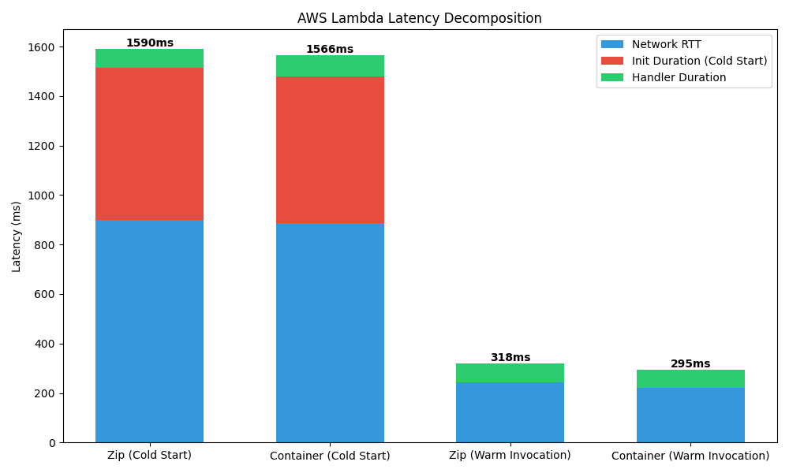
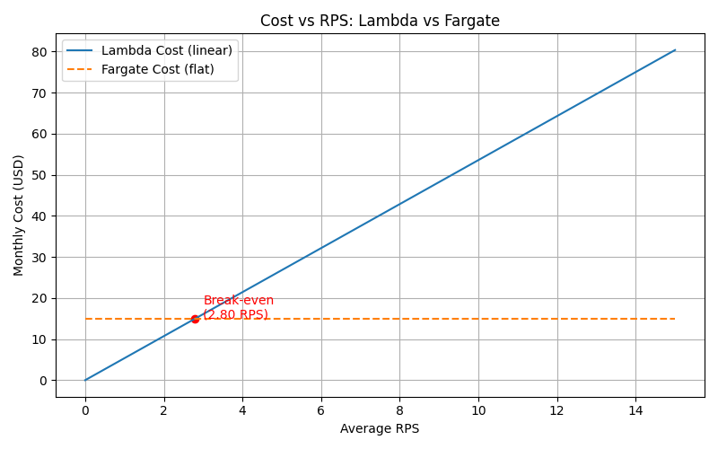
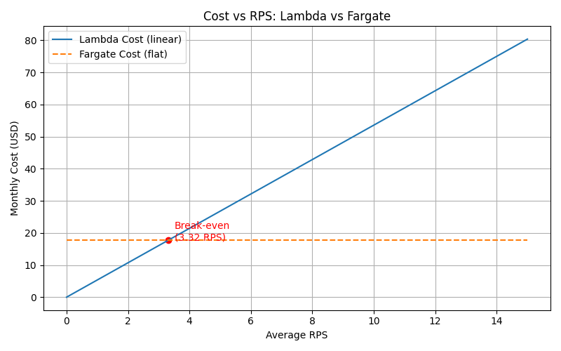

# Report

## Overview of tasks

This report analyzes the performance and cost characteristics of four deployment environments for a k-NN search service:

- AWS Lambda (ZIP)
- AWS Lambda (Container)
- AWS Fargate
- AWS EC2

The evaluation covers latency, cold starts, scalability, and cost under different traffic scenarios.

## Encountered problems

While trying to use Lambda i kept getting 403 error even when using oha with authorization. To fix that i disable IAM
protection on both Lambda functions.

# Assignment 1: Deploy All Environments

## Results

All environments returned identical k-NN results for the same query vector. The results can be seen
in [`results/assignment-1-endpoints.txt`](results/assignment-1-endpoints.txt)

---

# Assignment 2: Scenario A — Cold Start Characterization

## Results

## Analysis

1. The RTT may seem pretty big, but we must consider that invoking lambda function requires to start the TCP connection
   and do TLS handshake, also we must not forget about AWS Internal Routing and Lambda overhead. All these things and
   also the fact that we are connecting to the USA, may be the reason for such high RTT.

2. The measured cold start times for Lambda ZIP and container deployments are very similar, with the container-based
   deployment being slightly faster (592 ms vs 616 ms). This difference is small and within measurement variance.
   In theory, ZIP-based deployments are expected to have faster cold starts because they require less initialization
   overhead compared to container images. Containers may involve additional steps such as image loading and
   initialization
   of the runtime environment.
   However, in this experiment, the container image is relatively small and already cached by the Lambda service, which
   minimizes the overhead. As a result, both deployment types exhibit nearly identical cold start performance.
   Therefore, the observed difference is negligible, and both approaches can be considered equivalent in terms of cold
   start latency for this workload.

---

# Assignment 3: Scenario B — Warm Steady-State Throughput

## Results

| Environment      | Concurency | p50     | p95        | p99     | max     | Server avg |
|------------------|------------|---------|------------|---------|---------|------------|
| Lambda ZIP       | 5          | 224 ms  | 265 ms     | 511 ms  | 525 ms  | ~ 86 ms    |
| Lambda ZIP       | 10         | 212 ms  | 232 ms     | 520 ms  | 537 ms  | ~ 86 ms    |
| Lambda Container | 5          | 220 ms  | 269 ms     | 502 ms  | 542 ms  | ~ 70 ms    |
| Lambda Container | 10         | 206 ms  | 232 ms     | 507 ms  | 538 ms  | ~ 70 ms    |
| Fargate          | 10         | 788 ms  | 1003 ms    | 1181 ms | 1398 ms | ~ 23 ms    |
| Fargate          | 50         | 3905 ms | 4308 ms    | 4465 ms | 4592 ms | ~ 23 ms    |
| EC2              | 10         | 381 ms  | 544 ms     | 576 ms  | 638 ms  | ~ 30 ms    |
| EC2              | 50         | 910 ms  | 1142 ms ms | 1362 ms | 1529 ms | ~ 30 ms    |

## Analysis

1. Every p99 is lesser then 2 * 95 so there is no need to mark anything.

2. Lambda p50 latency remains almost constant when increasing concurrency from 5 to 10 because each request is handled
   by an independent execution environment. Lambda scales horizontally by creating new isolated environments, so there
   is no contention between requests. As a result, individual request latency remains stable regardless of concurrency,
   as long as the concurrency limit is not exceeded.

3. In contrast, Fargate and EC2 show a significant increase in p50 latency when concurrency increases from 10 to 50.
   This is because requests are handled by a single container or instance with limited CPU resources. As concurrency
   increases, requests begin to queue, leading to longer waiting times before execution. This queuing effect increases
   both median (p50) and tail latencies.

4. The server-side query_time_ms measures only the computation time of the k-NN algorithm inside the application,
   which in this case is pretty low. However, the client-observed p50 latency is significantly higher because
   it includes additional overheads such as network round-trip time, TLS handshake, request routing through AWS
   infrastructure, and serialization/deserialization of data.
   As a result, the majority of user-perceived latency is not due to computation but due to network and platform
   overhead. This explains the large difference between server-side and client-side measurements.

---

# Assignment 4: Scenario C — Burst from Zero

## Results

| Environment      | p50    | p95    | p99    | max    | Lambda cold starts |
|------------------|--------|--------|--------|--------|--------------------|
| Lambda ZIP       | 0.21 s | 1.53 s | 1.69 s | 1.69 s | 10                 |
| Lambda Container | 0.22 s | 1.45 s | 1.59 s | 1.62 s | 10                 |
| Fargate          | 4.11 s | 4.48 s | 4.59 s | 4.6 s  | -                  |
| EC2              | 0.95 s | 1.24 s | 1.42 s | 1.45 s | -                  |

## Analysis

1. Lambda exhibits significantly higher p99 latency then Fargate/EC2 during burst scenarios due to cold starts. After a
   period of
   inactivity, all execution environments are terminated. When the burst of requests arrives, Lambda must initialize up
   to the concurrency limit (10 environments), resulting in cold start delays of approximately 1.6–1.7 seconds. These
   slow requests dominate the tail latency, increasing p99 significantly compared to steady-state conditions.

2. The Lambda latency distribution is bimodal. The majority of requests are served by warm execution environments with
   latencies around 300 ms. However, a smaller group of requests experiences cold start delays, resulting in latencies
   around 1.6 seconds. This creates two distinct clusters in the latency histogram, corresponding to warm and cold
   executions.

3. Lambda does not meet the p99 < 500 ms service-level objective under burst conditions. The observed p99 latency of
   approximately 1.6–1.7 seconds is dominated by cold start delays. To meet the SLO, it would be necessary to eliminate
   or reduce cold starts, for example by using provisioned concurrency or keeping functions warm through periodic
   invocations.

# Assignment 5: Cost at Zero Load

## Pricing (us-east-1)

### Lambda

Lambda incurs **zero** cost during idle periods, as it is billed only for executed requests, so the total cost is 0$.

### Fargate

In this task we are using 0.5 vCPU and 1 GB memory. This is charged regardless of traffic, idle tasks cost the same as
busy ones.

vCPU cost:   0.5 * $0.04048 * 24 * 30 = $14.57

Memory cost: 1.0 * $0.004445 * 24 * 30 = $3.20

**Total is $17.77 a month.**

### EC2

In this task we are using t3.small instance so pricing is $0.0208/hour.
**Monthly cost: $0.0208 × 24 × 30 = $14.98**

To summarize

| Environment | Monthly Idle Cost |
|-------------|-------------------|
| Lambda      | $0                |
| Fargate     | $17.77            |
| EC2         | $14.98            |

## Analysis

1. Lambda incurs zero cost when idle because it is billed per request. Fargate and EC2 incur continuous cost regardless
   of
   usage.

# Assignment 6: Cost Model, Break-Even, and Recommendation

## 1 Monthly Requests Cost

### Peak Traffic

100 RPS * 1800 seconds = **180,000 requests/day**

### Normal Traffic

5 * 19,800 seconds = **99,000 requests/day**

### Total Daily Requests

180,000 + 99,000 = **279,000 requests/day**

### Monthly Requests (30 days)

279,000 * 30 = **8,370,000 requests/month**

---

### Lambda Cost Calculation

Given:

- Duration = **224 ms = 0.224 s**
- Memory = **0.5 GB**
- Price:
    - Requests: **$0.20 / 1M**
    - Compute: **$0.0000166667 per GB-second**

### Request Cost

Request cost can be calculated as requests/month * $0.20/1M
8,370,000 * 0.20 / 1,000,000 = 8,370,000 * 0.0000002 = $1.67

**So request cost is $1.67**

### Compute Cost

Compute cost can be calculated as GB-seconds/month * $0.0000166667

8,370,000 * 0,224 * 0,5 * 0.0000166667 = $15.62

**Compute cost is $15.62**

### Total Lambda Cost

$1.67 + $15.62 = $17.29

**Total Lambda Monthly Cost ≈ $17.29**

## 2. Break even RPS

The break-even point is where Lambda's variable cost equals an always-on alternative's fixed cost, so
lambda monthly cost has to be equal fixed monthly cost of EC2/Fargate. If we write this as equation

### Algebra

Lambda monthly cost = Fixed monthly cost

Average RPS * Seconds per month * (Computes cost + Request Cost) = Fixed monthly cost

### EC2

Solving for RPS for EC2:

Average RPS = $14.98 / (2,592,000 * ($0.0000002 + 0.077 * 0.5 × $0.0000166667))

**Average RPS = 2.80**

So above RPS = 2.80 Lambda is more expensive than EC2,

### Fargate

Solving for RPS for Fargate:

Average RPS = $17.77 / (2,592,000 * ($0.0000002 + 0.077 * 0.5 × $0.0000166667))

**Average RPS = 3.32**

So above RPS = 3.32 Lambda is more expensive than Fargate.

## 3. RPS plots

### Lambda vs EC2

### Lambda vs Fargate

## 4. Recommendation

## Recommendation

Based on the measured latencies, burst behavior, and cost analysis, **AWS EC2 (t3.small)** is the recommended deployment
environment for the k-NN workload under the given traffic model.

### Justification

The service-level objective (SLO) is **p99 < 500 ms**. Measured EC2 latency for 10 concurrent requests shows p50 = 381
ms, p95 = 544 ms, and p99 = 576 ms. While the p99 slightly exceeds 500 ms under moderate concurrency, this can be
mitigated by modest auto-scaling or increasing instance size. In comparison, Lambda and Fargate fail the SLO during
burst scenarios: Lambda p99 reaches approximately 1.6–1.7 seconds due to cold starts, while Fargate p99 at 10 RPS is
1.18 seconds and grows sharply with concurrency, up to 4.46 seconds at 50 concurrent requests.

From a cost perspective, EC2 is the most efficient always-on solution, with a monthly cost of $14.98 under the given
traffic model. Lambda and Fargate cost approximately $17.29 and $17.77 per month, respectively. Lambda only becomes
cost-effective at very low request rates (<3 RPS), as its break-even points indicate it surpasses EC2 cost at >2.8 RPS
and Fargate cost at >3.3 RPS.

Regarding scalability, EC2 can scale vertically (larger instance types) or horizontally (more instances) if traffic
spikes, ensuring SLO compliance. Fargate experiences queuing delays under higher concurrency, and Lambda requires
provisioned concurrency or periodic warm-up to avoid cold starts, which adds cost.

### Conditions for Recommendation Change

If the average load is extremely low (<3 RPS), Lambda becomes more cost-efficient due to zero idle cost. If the SLO were
relaxed to ~1.5 seconds p99, Lambda or Fargate could be used without provisioned concurrency. If traffic bursts
frequently exceed 50 concurrent requests, EC2 with auto-scaling or multiple Fargate tasks would be necessary to maintain
latency guarantees.

### Summary

EC2 offers the **best balance of cost and latency compliance** under the measured traffic and SLO. Lambda and Fargate
are suitable for highly variable or extremely low-traffic workloads but require additional configuration to meet the
p99 < 500 ms target.